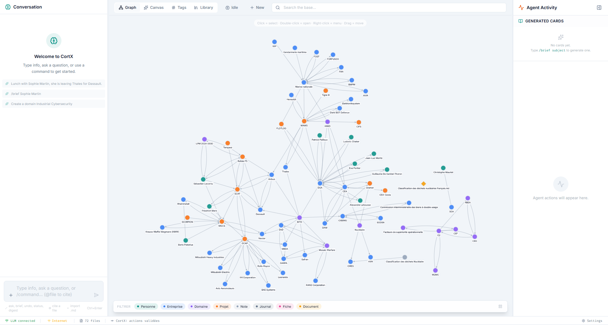

# CortX


### From vibe coding to vibe learning.
> A second brain powered by AI. You speak, the AI organizes. You search, the AI connects. You forget, the AI remembers.

CortX is a desktop application that applies the **Claude Code** paradigm to personal knowledge management. The user speaks in natural language — something learned, a person met, an idea — and an AI agent structures everything into Markdown files on their machine. No folders to create, no tags to invent. The agent decides where to store things, creates links between notes, and suggests unexpected connections.

Everything runs **locally** with an open-source model (Ollama, llama.cpp, LM Studio), or via an **API** (Claude, OpenAI) for more power. Your data stays on your machine.

**Available for Windows (NSIS installer) and macOS (DMG).** Linux build planned.



---
## Features

### AI Structuring Agent

The agent doesn't just answer — it **writes and modifies** the files in your knowledge base:
- **Fluid capture** — type raw text, the agent identifies entities (people, companies, concepts, projects, journal entries), creates or updates the corresponding Markdown files, and adds cross-links via `[[wikilinks]]`
- **Questions on the base** — ask your knowledge base without modifying it; the agent cites sources
- **Reflection** — think out loud, the agent suggests actions without executing them
- **Commands** — `/ask`, `/brief [topic]`, `/synthese`, `/digest`
- **Web enrichment** — `/wiki <topic>`, `/internet <url>`, or `/internet <query>` inject live web content (Wikipedia article, specific page, or top DuckDuckGo results) into the agent's context
- **Streaming + abortable** — see the LLM response token-by-token, cancel mid-generation if you change your mind
- **Multi-LLM compatibility** — `normalizeActions` accepts varying field names from Claude, llama.cpp, Ollama, LM Studio (English or French verbs)

Every action proposed by the agent is previewable (diff before/after) and requires your explicit approval. Nothing is written without your consent.


### Smart File Modification

`smartMerge` is deliberately conservative — LLMs frequently send partial content that would otherwise overwrite entire files. The pipeline:
- Defaults to **append-or-merge** when no explicit operation is specified
- `operation: "replace"` → full replace (only if explicit)
- `operation: "replace_line"` → string replace, requires `old_content`
- `section` field targets a specific Markdown heading
- Without section/operation → headings parsed from new content, each block appended under matching existing headings, dedup against existing content
- Frontmatter only re-stringified when the original file had it (no spurious `---\n---\n`)
- Auto-routes files to `Reseau/`, `Entreprises/`, `Domaines/`, `Projets/`, `Journal/` based on `type:` frontmatter when LLM omits a directory

### Interactive Knowledge Graph
Real-time Cytoscape · cose-bilkent visualization of all entities and their relations. Nodes colored by type (person, company, domain, project, note, journal, fiche), filtering, search, double-click exploration. Library documents appear as graph nodes alongside KB entities — bidirectional auto-links via `[[wikilinks]]` show as edges. Idle Mode highlights the nodes/edges currently being explored.

### Galaxy View
Alternative PixiJS-powered spatial visualization of the knowledge graph:
- **Louvain clustering** automatically groups entities into thematic clusters, labeled by dominant entity type
- **User-renameable cluster labels** persisted to `_System/galaxy-clusters.json`
- **Comets** — recently modified nodes rendered with a bloom glow so new activity stands out
- **Constellations** — isolated nodes (no edges) segregated visually
- **Time Scrubber** — drag to filter nodes by creation / modification date range
- **Filter panel** — toggle entity types, comets, constellations, and pulsation animations
- **Hover card** on mouse-over + **Focus card** on click with file metadata
- **Search** within the galaxy; double-click opens file preview

### Tag Browser
Enhanced tag panel with search, tag pills ranked by count, per-tag file list, and aggregate stats. Replaces the old tag cloud.


### Hybrid Search (RAG) with Multi-hop Expansion
Combines full-text indexing (FTS5) and semantic search via embeddings. After the initial retrieval, `expandMultiHop` follows wikilinks + library chunk references to pull related files into the context window — the agent sees a coherent cross-file picture without hallucinating links.

### Document Library — Powered by docling
Import and indexing of **PDF, DOCX, PPTX, XLSX, HTML, TXT, MD** via a Python sidecar:
- **docling** extracts clean text + structure (tables, headings, page numbers)
- **e5-small** generates 384-dim embeddings for each chunk (max 500 words)
- Three search modes: `lexical` (FTS5), `semantic` (cosine), `hybrid`
- **Auto-linking both ways** — KB files mentioning `[[DocTitle]]` link to library docs; library docs mentioning known KB entity names create reverse links. Both appear as graph edges.
- Lazy-spawned sidecar with newline-delimited JSON protocol; gracefully degrades if Python/docling not installed

### Web Search & Wikipedia Import
Fetch live web content directly from the chat — no API key, no third-party account:
- `/wiki Notion` — imports a Wikipedia article (REST API, mobile-sections endpoint) and generates a structured `.md` file (proposed, requires validation)
- `/internet https://...` — fetches a specific URL, extracts main content (`<article>` → `<main>` → `<body>`, strips nav/footer/script)
- `/internet <query>` — runs a DuckDuckGo HTML SERP scrape (no API), pulls in the top ~4 pages' main content in parallel, decodes DDG redirects to real URLs
- `/internet` alone — uses the rest of the user input as the query, so natural phrasing like *« mets à jour @MonProjet avec les dernières infos sur /internet »* works directly
- Language-aware: searches in app language (FR/EN) with automatic English fallback

### Automatic Git Versioning
Every accepted action = a Git commit (via isomorphic-git). Full history, one-click undo (`git revert`), and built-in `agent_log` audit table tying every commit to the original input.

### Timeline View
Chronological audit log of all agent activity in the center panel. Entries are grouped by date and show action counts, action verbs (create / modify), input type, and icons. Refreshes automatically on any KB change.

### Briefs & Fiches Archive
- `/brief [topic]` and `/synthese` generate structured briefs the agent saves to `Fiches/YYYY-MM-DD_HH-MM_slug.md` with frontmatter
- LLM output is sanitized (strips leading frontmatter, duplicate H1, code fences)
- Browse, preview, and delete fiches from a dedicated tab

### Telegram Bot Integration
Capture notes and query your knowledge base from anywhere via Telegram:
- Configure a bot token + authorized chat ID in Settings
- Messages sent to the bot go through the full agent pipeline (capture / question / reflection)
- Agent proposals are sent back with inline **Validate / Reject** buttons; accepted validations write files and reply with a commit summary
- Pure Q&A responses include answer text + cited sources
- Messages originating from Telegram are flagged with a badge in the app UI

### Idle Mode — Passive Insights
Background loop that explores your graph and generates insights without prompting:
- Phases cycle: `selecting` → `examining` → `thinking` → `insight` → `resting`
- Detects missing relations, contradictions, gaps, recurring patterns
- Insights persist to `_System/idle-insights.json`
- **Draft insights & promotion flow** — review queue, dismiss, or promote any insight to a permanent fiche in one click
- Active phase + explored nodes/edges mirrored in the graph in real time


### Manual File Editing
- In-app Markdown preview + edit mode
- `Ctrl+S` saves through `saveManualEdit` → commits + reindexes + logs to `agent_log`
- Live indicator shows which element (frontmatter `title`, first H1, or filename) drives the graph node label
- Title rename propagates: `files:updateTitle` updates frontmatter + H1, then runs case-insensitive `[[oldTitle]]` → `[[newTitle]]` rewrite across the entire KB; toast reports the count

### File Deletion
Delete any KB file from the UI — removes from disk, entities, relations, FTS, then commits and reindexes. `_System/*` is protected.

### Update Check & Banner
On launch, the app checks for new releases and surfaces a non-intrusive banner with the changelog when an update is available.

### Bilingual Interface (FR / EN)
Full UI in French and English. Web search and Wikipedia fetch run in the active language. Idle Mode insights are generated in the app's current language.

---
## Demo

**User:**
  Lunch with Sophie Martin. She's leaving Thales to join
  Dassault Aviation as Technical Director. She told me about
  the SCAF program — apparently the timeline has slipped by 6 months.

**Agent:**
  ~ Reseau/Sophie_Martin.md
    ✏️ Position updated: Thales → Dassault Aviation
    ➕ Interaction added: lunch on 04/26/2026
  + Entreprises/Dassault_Aviation.md [NEW]
    📄 Created with: aerospace sector, contact Sophie Martin
  ~ Domaines/Aerospace.md
    ➕ News: 6-month delay on the SCAF program
  [✓ Approve] [↩ Cancel]


> With a single raw text input, the agent identifies 1 person, 2 companies, and 1 program, modifies 3 files, creates 1 new file, and maintains all cross-links.

---

## Installation

### Prerequisites

- **Node.js** 20+
- **Git**
- A LLM of your choice:
  - **Local**: [Ollama](https://ollama.com), [LM Studio](https://lmstudio.ai), or llama.cpp with an OpenAI-compatible endpoint
  - **API**: an API key from [Anthropic](https://console.anthropic.com) (Claude) or OpenAI
- **Optional** — Python 3.10+ with `docling` + `sentence-transformers` for the library sidecar (PDF / DOCX / PPTX / XLSX import)

### Download

Pre-built installers are published on the [Releases page](https://github.com/gcorman/CortX/releases):
- **Windows** — `CortX-Setup-x.y.z.exe` (NSIS installer)
- **macOS** — `CortX-x.y.z.dmg` (universal)

### Run in development
```bash
git clone https://github.com/gcorman/CortX.git
cd CortX
npm install
npm run dev
```

### Build locally
```bash
npm run build     # Type-check + build main/preload/renderer to out/
npm run dist      # Package installer for current OS (Windows NSIS / macOS DMG)
```

> **Note:** If `better-sqlite3` fails to load, run `npm run rebuild` to recompile the native bindings against your Electron version.

### First-time configuration
On first launch, open Settings and configure:
1. **Base path** — folder where Markdown files will be stored (default: `~/Documents/CortX-Base/`)
2. **LLM Provider** — Anthropic (API key required) or OpenAI-compatible (Ollama, llama.cpp, LM Studio — no key needed). API key is stored locally and masked in the UI.
3. **Model** — the model to use for the agent
4. **Validation mode** — auto-approve safe actions, or require explicit approval on every change
5. **Language** — FR or EN; persists to localStorage

---
## Architecture
### Tech Stack
| Component          | Technology                          |
|--------------------|-------------------------------------|
| Desktop App        | Electron 41                         |
| Frontend           | React 19 + Tailwind CSS             |
| State              | Zustand                             |
| Database           | SQLite (better-sqlite3) + FTS5 + embeddings |
| Versioning         | isomorphic-git                      |
| Graph              | Cytoscape.js (fcose + cose-bilkent) |
| Galaxy View        | PixiJS + pixi-filters (Louvain clustering, bloom effects) |
| LLM                | Anthropic SDK + OpenAI-compatible (fetch) |
| Telegram           | node-telegram-bot-api (long-poll) |
| Web fetch          | Node.js built-in fetch + Wikipedia REST API + DuckDuckGo HTML SERP |
| Documents          | Python sidecar (docling + sentence-transformers / e5-small) |

### Agent Pipeline — Propose-then-Execute
**Propose-then-execute** architecture: the agent never modifies files without explicit user validation.

```
USER INPUT
      │
      ▼
┌─────────────────┐
│ CONTEXT SEARCH  │ ← FTS5 + embeddings + multi-hop expansion
│      (RAG)      │   + library chunks + web sources (/wiki /internet)
└────────┬────────┘
         ▼
┌─────────────────┐
│   LLM CALL      │ ← System prompt + context + input
│   (streaming)   │   abortable mid-generation
└────────┬────────┘
         ▼
┌─────────────────┐
│ JSON PARSING    │ ← Multi-fallback (strict → code block → regex)
│ + NORMALIZATION │   field aliases, FR/EN verbs, dir auto-routing
└────────┬────────┘
         ▼
┌─────────────────┐
│  PROPOSAL       │ ← Actions with status: 'proposed'
│ (preview diff)  │   No files written yet
└────────┬────────┘
         ▼
     User approves / rejects
         │
         ▼
┌─────────────────┐
│  EXECUTION      │ ← smartMerge file writes + git commit
│ + REINDEXING    │   + SQLite update + agent_log entry
└─────────────────┘
```

### User Data Structure
```
CortX-Base/
├── Reseau/             ← People profiles
├── Entreprises/        ← Organization profiles
├── Domaines/           ← Knowledge domains
├── Projets/            ← Current or past projects
├── Journal/            ← Daily entries
├── Fiches/             ← Briefs, syntheses, promoted idle insights
├── Bibliotheque/       ← Imported PDF/DOCX/XLSX/PPTX (git-ignored)
├── _Templates/         ← Optional user templates
├── _System/
│   ├── cortx.db                ← SQLite (FTS5, entities, relations, library, agent_log)
│   ├── idle-insights.json      ← Persisted idle-mode insights
│   └── library-cache/          ← Extracted text + embedding cache (git-ignored)
└── .git/                       ← Automatic versioning
```

Each Markdown file follows a standardized format with YAML frontmatter (type, tags, dates, relations) and wikilinks `[[Entity]]` for cross-references.

### Database Tables
1. `files` — path, type, title, tags, content_hash, timestamps
2. `entities` — id, name, type, file_path, aliases
3. `relations` — source/target entity IDs, relation_type, source_file (19 inferred relation types)
4. `files_fts` — FTS5 virtual table (path, title, content)
5. `kb_embeddings` — file_path, vector BLOB
6. `library_documents` — id, path, filename, mime_type, hash_sha256, title, author, page_count, summary, tags, status
7. `library_chunks` — id, document_id, chunk_index, page range, heading, text
8. `library_chunks_fts` — FTS5 virtual table
9. `library_embeddings` — chunk_id → vector BLOB
10. `library_links` — document_id ↔ entity_id (auto-detected mentions)
11. `file_library_links` — file_path ↔ document_id (from `[[wikilinks]]`)
12. `agent_log` — timestamp, input_text, actions_json, commit_hash, status

### LLM Modes
| Mode       | Description |
|------------|-------------|
| **100% Local** | Ollama / llama.cpp / LM Studio — total privacy, no data leaves the machine, no key |
| **Cloud API**  | Claude (Anthropic) or any OpenAI-compatible `/v1/chat/completions` endpoint — best quality, requires API key (stored locally, never re-uploaded) |

---
## Project Status
### What works (April 2026)
| Feature                                              | Status |
|------------------------------------------------------|--------|
| Agent pipeline (capture / question / reflection)     | ✅ |
| LLM integration (Anthropic + OpenAI-compatible)      | ✅ |
| Streaming + abortable LLM responses                  | ✅ |
| Interactive knowledge graph                          | ✅ |
| Hybrid search (FTS5 + embeddings) + multi-hop        | ✅ |
| Automatic Git versioning + undo                      | ✅ |
| 3-panel resizable interface                          | ✅ |
| Manual edit mode + Ctrl+S commit                     | ✅ |
| Title rename + automatic wikilink rewrite            | ✅ |
| File deletion (KB + library)                         | ✅ |
| Document import (PDF, DOCX, XLSX, PPTX) via docling  | ✅ |
| Idle Mode (passive insights) + draft promotion       | ✅ |
| Briefs / fiches archive                              | ✅ |
| `/wiki` and `/internet` web enrichment               | ✅ |
| Internationalization (FR / EN)                       | ✅ |
| Update check + release banner                        | ✅ |
| Galaxy View (PixiJS, Louvain clustering, time scrub) | ✅ |
| Timeline View (agent activity log)                   | ✅ |
| Telegram bot integration                             | ✅ |
| Windows installer (NSIS)                             | ✅ |
| macOS DMG release                                    | ✅ |
| Global quick capture (system shortcut)               | 🔜 |
| PDF / Markdown export                                | 🔜 |
| Voice input                                          | 🔜 |
| Linux packaging                                      | 🔜 |

### Recommended Local Models
**For the agent (classification + planning):**
- Gemma 3 4B or Qwen 3 4B — runs on 8 GB RAM
- Gemma 3 12B or Qwen 3 14B — better quality, 16 GB RAM
- Mistral Small 24B — excellent, 32 GB RAM or GPU

**For embeddings (semantic search):**
- nomic-embed-text (137M params) — runs everywhere
- snowflake-arctic-embed-m — solid alternative

---
## Positioning
### Why CortX?
Note-taking tools (Obsidian, Notion, Logseq) assume the user will structure their own thinking. The #1 barrier to a true "second brain" is not the lack of tools — it's the **cognitive load of maintenance**.

CortX reduces the entry cost to **zero**. The user types raw text. The agent does the rest.

### What sets us apart
|                            | Mem.ai | Khoj | Obsidian + AI | CortX |
|----------------------------|--------|------|---------------|-------|
| Agent **writes** the files | ❌     | ❌   | ❌            | ✅    |
| **Local** Markdown files   | ❌     | ❌   | ✅            | ✅    |
| **100% local** LLM possible| ❌     | ✅   | ❌            | ✅    |
| Knowledge Graph            | ❌     | ❌   | ✅ (plugin)   | ✅    |
| Propose-then-execute       | ❌     | ❌   | ❌            | ✅    |
| Git versioning + undo      | ❌     | ❌   | ❌            | ✅    |
| docling document import    | ❌     | partial | partial    | ✅    |

---
## Contributing
The project is under active development. Contributions are welcome:
- **Bug reports** — open an issue with reproduction steps
- **Testing with different LLMs** — feedback on agent quality with various local models
- **UX suggestions** — ideas to improve the interface
- **Technical architecture** — suggestions on RAG, embeddings management, performance

### Development
```bash
npm run dev      # Electron dev mode with HMR
npm run build    # Compile main/preload/renderer
npm run dist     # Build installer for current OS
npm run rebuild  # Recompile better-sqlite3
```

No test runner configured yet.


## License
- ISC

*CortX — From vibe coding to vibe learning.*
