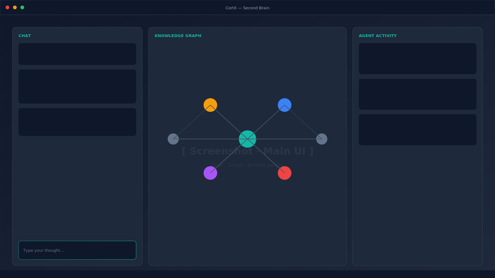
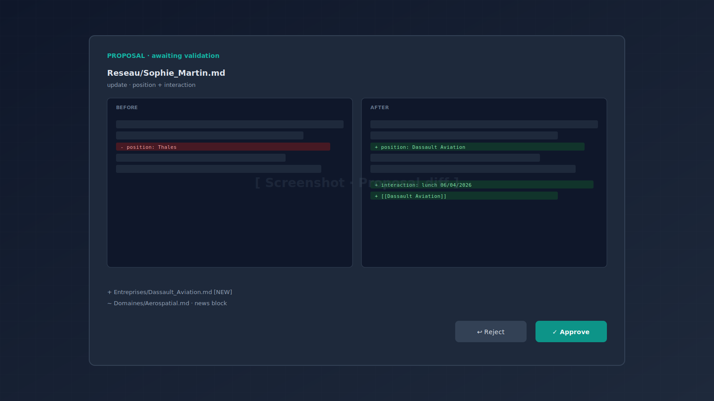
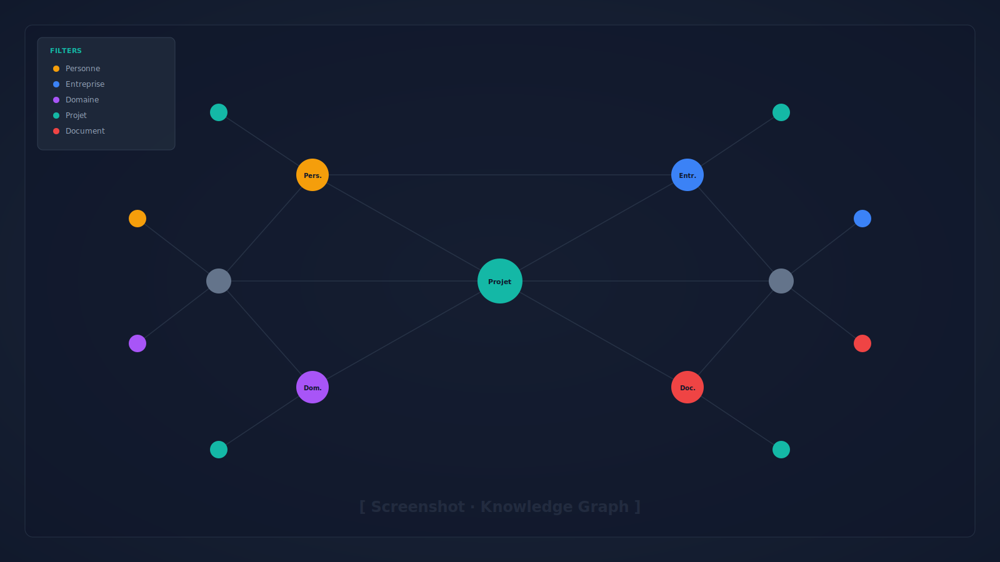
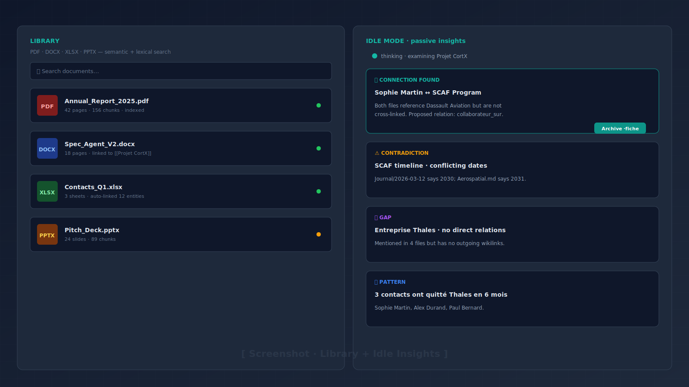

# CortX


### From vibe coding to vibe learning.
> A second brain powered by AI. You speak, the AI organizes. You search, the AI connects. You forget, the AI remembers.

CortX is a desktop application that applies the **Claude Code** paradigm to personal knowledge management. The user speaks in natural language — something learned, a person met, an idea — and an AI agent structures everything into Markdown files on their machine. No folders to create, no tags to invent. The agent decides where to store things, creates links between notes, and suggests unexpected connections.

Everything runs **locally** with an open-source model (Ollama, llama.cpp, LM Studio), or via an **API** (Claude, OpenAI) for more power. Your data stays on your machine.



---
## Features

### AI Structuring Agent

The agent doesn’t just answer — it **writes and modifies** the files in your knowledge base:
- **Fluid capture** — type raw text, the agent identifies entities (people, companies, concepts), creates or updates the corresponding Markdown files, and adds cross-links
- **Questions on the base** — ask your knowledge base without modifying it; the agent cites sources
- **Reflection** — think out loud, the agent suggests actions without executing them
- **Commands** — `/ask`, `/brief [topic]`, `/synthese`, `/digest`
- **Web enrichment** — use `/wiki <topic>`, `/internet <url>`, or `/internet <query>` to inject live web content (Wikipedia article, specific page, or a full DuckDuckGo search whose top pages are fetched and read) into the agent’s context before it proposes actions

Every action proposed by the agent is previewable (diff before/after) and requires your explicit approval. Nothing is written without your consent.



### Interactive Knowledge Graph
Real-time visualization of relationships between all entities in the base. Nodes are colored by type (person, company, domain, project), with filtering, search, and exploration via double-click.



### Hybrid Search (RAG)
Search combining full-text indexing (FTS5) and semantic search via embeddings. The agent retrieves relevant files before every response.

### Document Library
Import and indexing of PDF, DOCX, PPTX, and XLSX files. Documents are chunked, vectorized, and integrated into the agent’s context.

### Web Search & Wikipedia Import
Fetch live web content directly from the chat:
- `/wiki Notion` — imports a Wikipedia article and generates a structured `.md` file (proposed, requires validation)
- `/internet https://...` — fetches a specific URL and injects its readable main content as context
- `/internet <query>` — runs a DuckDuckGo search (no API key, no account) and pulls in the top ~4 pages’ main content, so the agent can answer with fresh information (e.g. *« Met à jour le paragraphe "actualité" de @MonProjet avec les dernières infos accessibles sur /internet »*)
- Language-aware: searches Wikipedia / DuckDuckGo in the app’s selected language (FR/EN) with automatic English fallback

### Automatic Versioning
Every accepted action = a Git commit. Full history, one-click undo (`git revert`), and built-in audit log.

### Idle Mode — Passive Insights
In the background, the agent explores the base and generates insights: hidden connections, contradictions, gaps, and patterns.



### Bilingual Interface
Full interface available in French and English.

---
## Demo

**User:** 
  Lunch with Sophie Martin. She’s leaving Thales to join
  Dassault Aviation as Technical Director. She told me about
  the SCAF program — apparently the timeline has slipped by 6 months.

**Agent:**
  ~ Network/Sophie_Martin.md
    ✏️ Position updated: Thales → Dassault Aviation
    ➕ Interaction added: lunch on 06/04/2026
  + Companies/Dassault_Aviation.md [NEW]
    📄 Created with: aerospace sector, contact Sophie Martin
  ~ Domains/Aerospace.md
    ➕ News: 6-month delay on the SCAF program
  [✓ Approve] [↩ Cancel]


>With a single raw text input, the agent identifies 1 person, 2 companies, and 1 program, modifies 3 files, creates 1 new file, and maintains all cross-links.

---

## Installation

### Prerequisites

- **Node.js** 20+
- **Git**
- A LLM of your choice:
  - **Local**: [Ollama](https://ollama.com), [LM Studio](https://lmstudio.ai), or llama.cpp with an OpenAI-compatible endpoint
  - **API**: an API key from [Anthropic](https://console.anthropic.com) (Claude) or OpenAI

### Run in development
```bash
git clone https://github.com/gcorman/CortX.git
cd CortX
npm install
npm run dev
```

### Build for Windows
```bash
npm run build     # Compile TypeScript
npm run dist      # Generate NSIS installer in dist/
```

> **Note:** If `better-sqlite3` fails to load, run `npm run rebuild` to recompile the native bindings.

### Configuration
On first launch, configure in the settings:
1. **Base path** — folder where Markdown files will be stored (default: `~/Documents/CortX-Base/`)
2. **LLM Provider** — Anthropic (API key required) or OpenAI-compatible (Ollama, llama.cpp — no key needed)
3. **Model** — the model to use for the agent
---
## Architecture
### Tech Stack
| Component          | Technology                          |
|--------------------|-------------------------------------|
| Desktop App        | Electron 41                         |
| Frontend           | React 19 + Tailwind CSS             |
| State              | Zustand                             |
| Database           | SQLite (better-sqlite3) + FTS5 + embeddings |
| Versioning         | isomorphic-git                      |
| Graph              | Cytoscape.js (fcose + cose-bilkent) |
| LLM                | Anthropic SDK + OpenAI-compatible (fetch) + Google AI |
| Web fetch          | Node.js built-in fetch + Wikipedia REST API |
| Documents          | Python sidecar (docling, openpyxl, python-pptx) |

### Agent Pipeline — Propose-then-Execute
**Propose-then-execute** architecture: the agent never modifies files without explicit user validation.

```
USER INPUT
      │
      ▼
┌─────────────────┐
│ CONTEXT SEARCH  │ ← FTS5 + embeddings + multi-hop
│      (RAG)      │
└────────┬────────┘
         ▼
┌─────────────────┐
│   LLM CALL      │ ← System prompt + context + input
│   (streaming)   │
└────────┬────────┘
         ▼
┌─────────────────┐
│ JSON PARSING    │ ← Multi-fallback (strict → code block → regex)
│ + NORMALIZATION │
└────────┬────────┘
         ▼
┌─────────────────┐
│  PROPOSAL       │ ← Actions with status: 'proposed'
│ (preview diff)  │ No files written yet
└────────┬────────┘
         ▼
     User
   approves / rejects
         │
         ▼
┌─────────────────┐
│  EXECUTION      │ ← File writing + git commit
│ + REINDEXING    │ + SQLite update
└─────────────────┘
```

### User Data Structure
```
CortX-Base/
├── Network/          ← People profiles
├── Companies/        ← Organization profiles
├── Domains/          ← Knowledge domains
├── Projects/         ← Current or past projects
├── Journal/          ← Daily entries
├── Notes/            ← Generated briefs and syntheses
├── Library/          ← Imported documents (PDF, DOCX…)
├── _System/
│   └── cortx.db       ← SQLite (index, embeddings, relations, logs)
└── .git/             ← Automatic versioning
```

Each Markdown file follows a standardized format with YAML frontmatter (type, tags, dates, relations) and wikilinks `[[Entity]]` for cross-references.

### Three LLM Modes
| Mode       | Description |
|------------|-------------|
| **100% Local** | Ollama / llama.cpp / LM Studio — total privacy, no data leaves the machine |
| **API**        | Claude (Anthropic) or OpenAI — best quality, requires API key |
| **Hybrid**     | Local for simple tasks, API for complex ones *(planned)* |

---
## Project Status
### What works (April 2026)
| Feature                                 | Status |
|-----------------------------------------|--------|
| Agent pipeline (capture / question / reflection) | ✅ Complete |
| LLM integration (Anthropic + OpenAI-compatible) | ✅ Complete |
| Interactive knowledge graph             | ✅ Complete |
| Hybrid search (FTS5 + embeddings)       | ✅ Complete |
| Automatic Git versioning + undo         | ✅ Complete |
| 3-panel resizable interface             | ✅ Complete |
| Document import (PDF, DOCX, XLSX, PPTX) | ✅ Complete |
| Idle Mode (passive insights)            | ✅ Complete |
| Internationalization (FR / EN)          | ✅ Complete |
| Settings (LLM, path, validation, language) | ✅ Complete |
| Web enrichment (/wiki + /internet)      | ✅ Complete |
| Hybrid LLM router (local/API auto)      | 🔜 Planned |
| Global quick capture (system shortcut)  | 🔜 Planned |
| PDF / Markdown export                   | 🔜 Planned |
| Voice input                             | 🔜 Planned |
| macOS / Linux packaging                 | 🔜 Planned |

### Recommended Local Models
**For the agent (classification + planning):**
- Gemma 3 4B or Qwen 3 4B — runs on 8 GB RAM
- Gemma 3 12B or Qwen 3 14B — better quality, 16 GB RAM
- Mistral Small 24B — excellent, 32 GB RAM or GPU

**For embeddings (semantic search):**
- nomic-embed-text (137M params) — runs everywhere
- snowflake-arctic-embed-m — solid alternative
---
## Positioning
### Why CortX?
Note-taking tools (Obsidian, Notion, Logseq) assume the user will structure their own thinking. The #1 barrier to a true “second brain” is not the lack of tools — it’s the **cognitive load of maintenance**.

CortX reduces the entry cost to **zero**. The user types raw text. The agent does the rest.

### What sets us apart
|                          | Mem.ai | Khoj | Obsidian + AI | CortX |
|--------------------------|--------|------|---------------|-------|
| Agent **writes** the files | ❌     | ❌   | ❌            | ✅    |
| **Local** Markdown files | ❌     | ❌   | ✅            | ✅    |
| **100% local** LLM possible | ❌  | ✅   | ❌            | ✅    |
| Knowledge Graph          | ❌     | ❌   | ✅ (plugin)   | ✅    |
| Propose-then-execute     | ❌     | ❌   | ❌            | ✅    |

---
## Contributing
The project is under active development. Contributions are welcome:
- **Bug reports** — open an issue with reproduction steps
- **Testing with different LLMs** — feedback on agent quality with various local models
- **UX suggestions** — ideas to improve the interface
- **Technical architecture** — suggestions on RAG, embeddings management, performance

### Development
```bash
npm run dev      # Electron dev mode with HMR
npm run build    # Compile main/preload/renderer
npm run dist     # Build + Windows installer (NSIS)
npm run rebuild  # Recompile better-sqlite3
```

No test runner configured yet.


## License
- ISC

*CortX — From vibe coding to vibe learning.*
